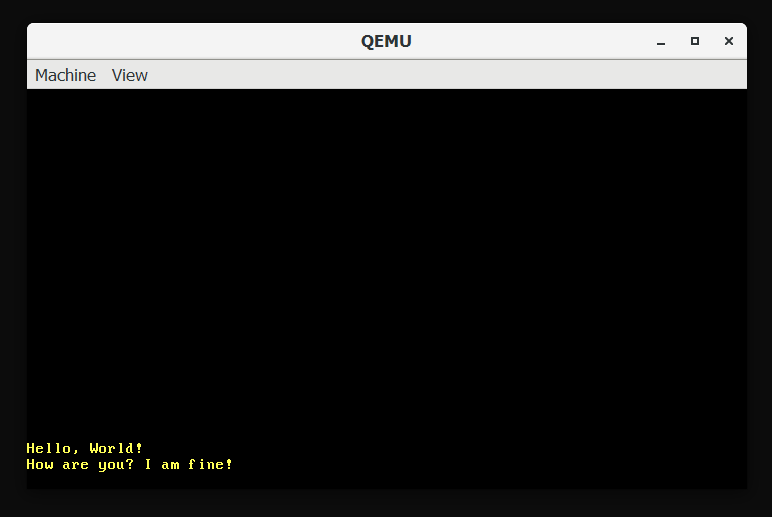

# Catalyst OS
A toy OS in rust.


---

## Setup
Currently, there are no prebuilt binaries.
Instead, you can build and run it from source code.

**Note:** You need to have `qemu` installed.

```bash

# Clone the repo
git clone https://github.com/ShardulNalegave/catalyst-os.git catalyst
cd catalyst

cd kernel
rustup override set nightly

# To build the kernel:-
cargo build

# To run the kernel (Note: this will rebuild the kernel):-
cargo run

# To run the tests
cargo test

```

---
**Licensed under the [MIT License](./LICENSE)**